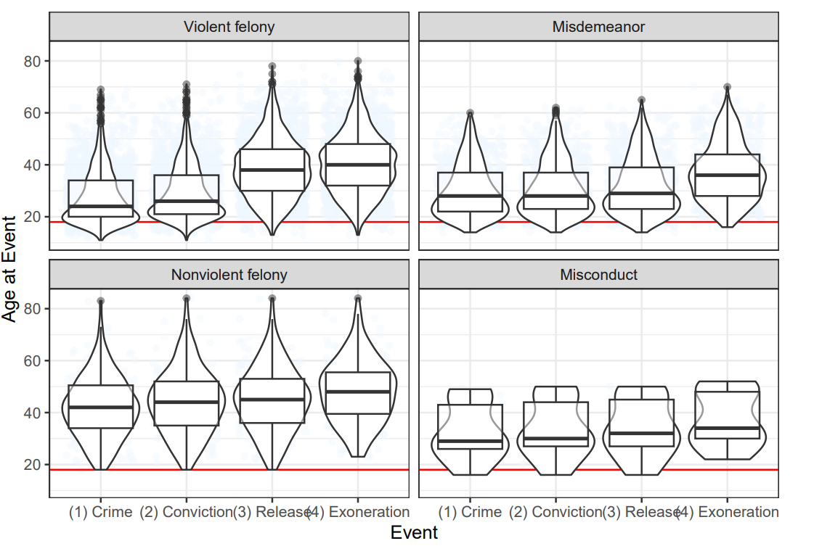

### Statistical Plan over June, July, August 2024

# July 25

**Alejandro** found that unlike other crime categories, exonerees convicted of a nonviolent felony are mostly white and mostly middle-aged. He wondered if this group exists in the registry due to selection bias (by exoneration projects) or is representative of the population of nonviolent felony convictions. He created a boxplot to illustrate that exonerees convicted of a violent felony experienced a gap between conviction and release. This is unlike other crime categories, whose distribution of age across events (crime, conviction, release, exoneration) suggests that these events generally occur within a similar time period.

**Nayak** asked if among similar crimes, how time between conviction and exoneration compares between Black and white people. He also requested that Alejandro explain his boxplots, particularly the labels. Alejandro sent an email doing so.

# July 29

**Alejandro** corrected the feature engineering script to now remove an invalid observation (Anthony Gayle).

**Alejandro** compared groups of race, adjusting for offense. He created a table for sample size and years served, and plots for age distributions.

# August 12

**Alejandro** completed functions to illustrate in multiple forms the distribution of years spent incarcerated and convicted, by offense and race.
